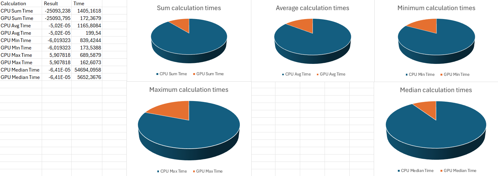

# Párhuzamos eszközök programozása - féléves feladat leírása
Alapvető matematikai statisztikák, mint az Összeg, Átlag, Minimum, Maximum és Medián értékek számítása CPU-n és GPU-n C# host programmal.
A beadandó bizonyítja, hogy a statisztikák számítása, megfelelő workitem szám használatával GPU-n sokkal gyorsabb eredményt ad, mint a CPU-n számított statisztikák.

A szoftver, első körben képes a ,,calculations.cl'' OpenCL kernel fájl felolvasására, majd a Cloo NuGet package segítségével egy olyan host programot reprezent, mely bármelyik kernel függvény felolvasására és lefuttatására funkcionál.

A szoftver futtatása után a felhasználó beállíthatja a probléma méretét, majd a ,,START MEASUREMENT'' gombra kattintva, elindíthatja a mérési folyamatot.
A mérés során a program párhuzamos dolgozza fel az egyes számításokat, és a futás végén szövegdobozokba írja az eredményeket, és kimenti őket egy CSV fájlba is.

*A szoftver, futás közben*

*A számítások eredményei*

Az alábbi Excel fájlban létrehozott diagrammok szemléletesebben kiemelik a CPU és GPU futási idők közti különbségeket:

*Mérési különbségek*